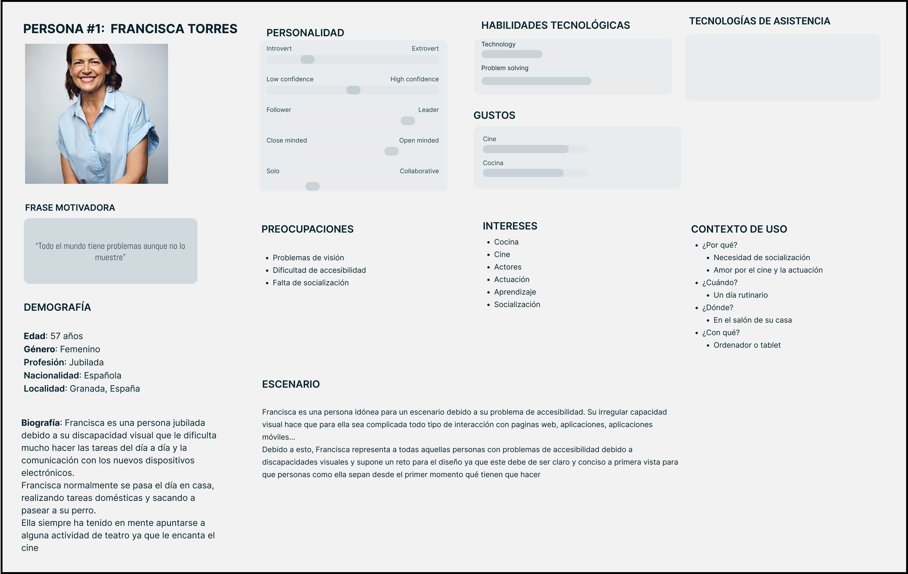

## DIU - Practica1, entregables

- <b>User research - (plan) template </b>
Realizaremos varias encuestas a numerosas personas en un abanico de edad muy amplio. Los temas podrían ser ¿Cuánto estarían dispuestos a pagar por unas clases de teatro? ¿Cuánto pagarían por ver una obra de teatro?
 
La investigación nos proporcionará un abanico de edades y precios que algunas de estas personas estarían dispuestas a pagar por una actividad. Con este enfoque, podríamos precisar hacia qué público y edades deberían de estar destinados nuestro servicios para un mayor porcentaje de éxito.

- <b> Desk research: Análisis Competencia </b>
En este análisis de competencia llevamos acabo un estudio de tres empresas de la competencia como son The Actors Studio, The Second City, y Teatro Real.
 
Con cada de una de las empresas vamos a ver una serie de características, en Bussiness Model nos centramos en el Precio, Marketing y Ofertas las cuales son las bases para un buen negocio.
En technological issues hay que tener en cuenta la plataforma la seguridad de la misma y la velocidad/rendimiento.
En functionality valoramos la Facilidad el Soporte de la página y la compatibilidad con diversos navegadores y dispositivos.
Con usability lo mas importante de valorar es la navegación por la pagina, la claridad de la misma y la accesibilidad para personas de todas las edades.
Y finalmente una serie de subjective issues como las fuerzas y las debilidades y una conclusión final

- <b>2 Personas</b>

Persona #1: Representa fielmente a las personas con problemas de accesibilidad debido a una o varias discapacidades

Persona #2: Esta persona representa a aquellas personas muy centradas en el trabajo que necesitan una vía de escape para volver a socializar y despejarse

- <b>2 User Journey Map  ( 1 por persona)</b>

Persona #1: El escenario de esta persona representa fielmente un escenario habitual en el que una persona con discapacidad intenta contratar un servicio a través de una página web

Persona #2: Representa el escenario que recorre una persona trabajadora hasta que consigue asistir a un curso de la app y sus conclusiones finales

- <b>Revisión de Usabilidad</b>

> <b>documento:</b>  Usability-review-template-2.pdf / Usability-review-template.xlsx.
 

> <b>Valoración final (numérica):</b> 6,5
 

> <b>Comentario sobre la valoración:</b> Es una página web correcta, cumple con sus funcionalidades principales de información aunque tiene pequeños errores y algunos conceptos no son del todo intuitivos.

(valoración y conclusiones de esta etapa)

- <b>Briefing</b>

Como resumen de esta práctica nos gustaría compartir que bajo nuestro punto de vista no se trata de una página web mal implementada ni horrible. Tiene muchos puntos que mejorar, algunos más generales y otros más específicos, pero ninguno de ellos hace empeorar la experiencia del usuario a niveles catastróficos.
