# DIU24
Prácticas Diseño Interfaces de Usuario 2023-24 (Tema: .... ) 

Grupo: DIU1_PaloSeco.  Curso: 2023/24 
Updated: 14/3/2024

Proyecto: 
>>> Decida el nombre corto de su propuesta en la práctica 2
Oasis

Descripción: 
>>> Describa la idea de su producto en la práctica 2 
Polideportivo que oferta cursos y alquileres de pistas

Logotipo: 
>>> Opcionalmente si diseña un logotipo para su producto en la práctica 3 pongalo aqui
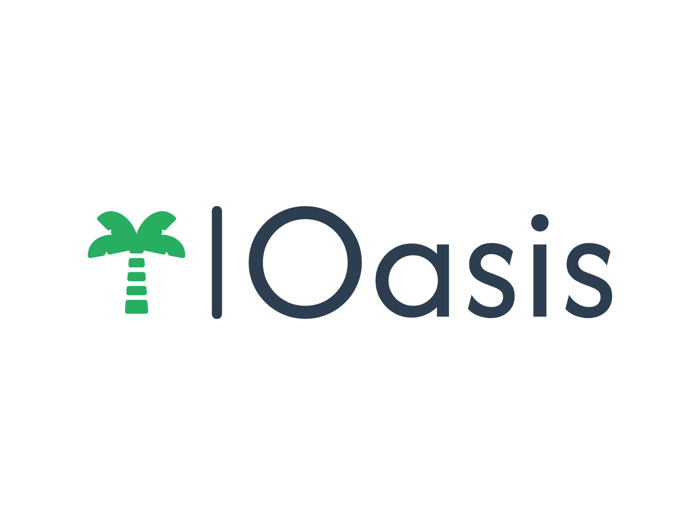

Miembros
 * :bust_in_silhouette:  Adrián Castro Reyes     :octocat:     
 * :bust_in_silhouette:  Antonio García Torres     :octocat:

-----
# Proceso de Diseño 

## Paso 1. UX User & Desk Research & Analisis 

 **1.a User Reseach Plan**
-----

<b>User research - (plan) template </b>
Realizaremos varias encuestas a numerosas personas en un abanico de edad muy amplio. Los temas podrían ser ¿Cuánto estarían dispuestos a pagar por unas clases de teatro? ¿Cuánto pagarían por ver una obra de teatro?
 
La investigación nos proporcionará un abanico de edades y precios que algunas de estas personas estarían dispuestas a pagar por una actividad. Con este enfoque, podríamos precisar hacia qué público y edades deberían de estar destinados nuestro servicios para un mayor porcentaje de éxito. 

 1.b Competitive Analysis
-----

En este análisis de competencia llevamos acabo un estudio de tres empresas de la competencia como son The Actors Studio, The Second City, y Teatro Real.
 
En este análisis de competencia llevamos acabo un estudio de tres empresas de la competencia como son The Actors Studio, The Second City, y Teatro Real.
 
Con cada de una de las empresas vamos a ver una serie de características, en Bussiness Model nos centramos en el Precio, Marketing y Ofertas las cuales son las bases para un buen negocio.
En technological issues hay que tener en cuenta la plataforma la seguridad de la misma y la velocidad/rendimiento.
En functionality valoramos la Facilidad el Soporte de la página y la compatibilidad con diversos navegadores y dispositivos.
Con usability lo mas importante de valorar es la navegación por la pagina, la claridad de la misma y la accesibilidad para personas de todas las edades.
Y finalmente una serie de subjective issues como las fuerzas y las debilidades y una conclusión final

 1.c Persona
-----

Persona #1: Representa fielmente a las personas con problemas de accesibilidad debido a una o varias discapacidades

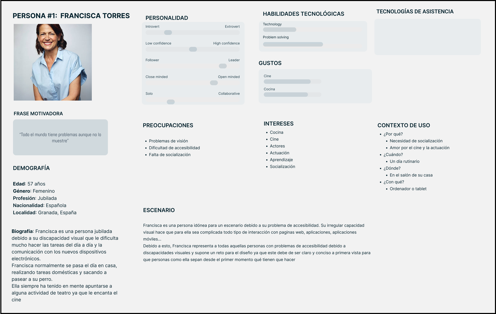

Persona #2: Esta persona representa a aquellas personas muy centradas en el trabajo que necesitan una vía de escape para volver a socializar y despejarse

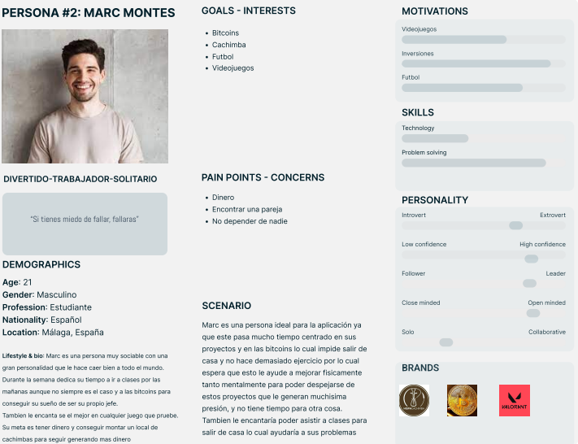

 1.d User Journey Map
----
Persona #1: El escenario de esta persona representa fielmente un escenario habitual en el que una persona con discapacidad intenta contratar un servicio a través de una página web

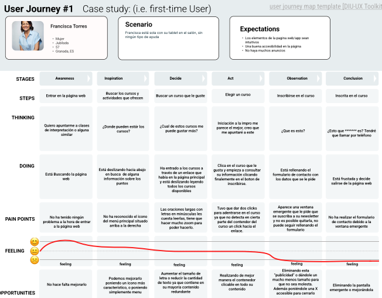

Persona #2: Representa el escenario que recorre una persona trabajadora hasta que consigue asistir a un curso de la app y sus conclusiones finales
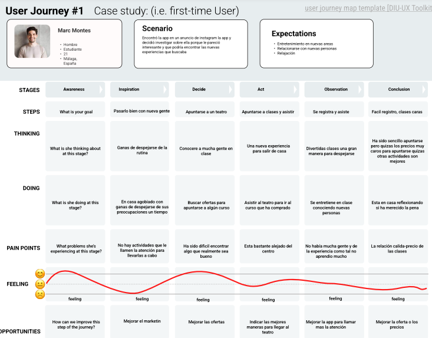

 1.e Usability Review
----
>> Revisión de usabilidad: (toma los siguientes documentos de referencia y verifica puntos de verificación de usabilidad
> - documento:  Usability-review-template-2.pdf / Usability-review-template.xlsx
> - Valoración final (numérica): 6,5
> - Comentario sobre la valoración: Es una página web correcta, cumple con sus funcionalidades principales de información aunque tiene pequeños errores y algunos conceptos no son del todo intuitivos.

## Paso 2. UX Design  

 2.a Reframing / IDEACION: Feedback Capture Grid / EMpathy map 
----

>>> Comenta con un diagrama los aspectos más destacados a modo de conclusion de la práctica anterior,

 Interesante | Críticas     
| ------------- | -------
  Preguntas | Nuevas ideas
  
    
>>> ¿Que planteas como "propuesta de valor" para un nuevo diseño de aplicación para economia colaborativa ?
>>> Problema e hipótesis
>>>  Que planteas como "propuesta de valor" para un nuevo diseño de aplicación para economia colaborativa te
>>> (150-200 caracteres) 
 
Oasis es un polideportivo que consiste en la creación de unas instalaciones para poder
ofrecer a nuestros clientes diferentes talleres de diferentes deportes, para que todas
las edades puedan disfrutar del deporte.
Nuestra misión es conseguir expandir la importancia del deporte fomentando el
crecimiento tanto personal como profesional de los clientes ofreciendo una amplia
gama de cursos, deportes y oportunidades de competición.

 2.b ScopeCanvas
----
>>> Propuesta de valor 
----

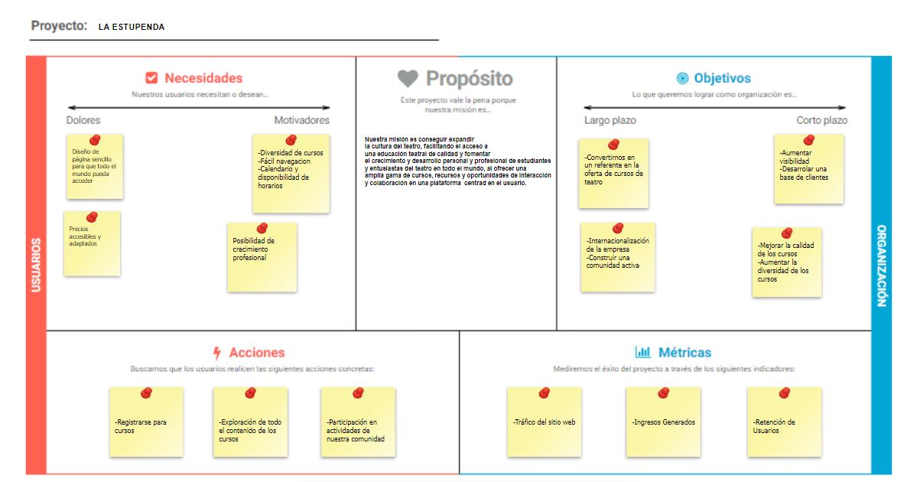

 2.b User Flow (task) analysis 
-----

>>> Definir "User Map" y "Task Flow" ... 

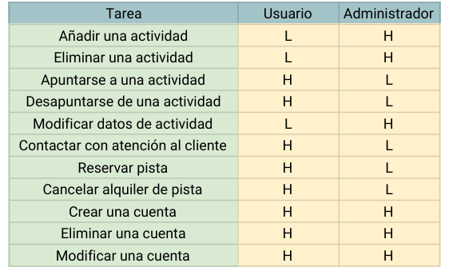

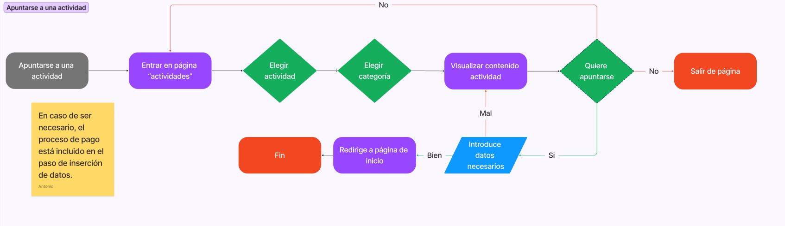
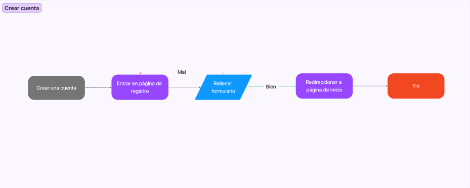
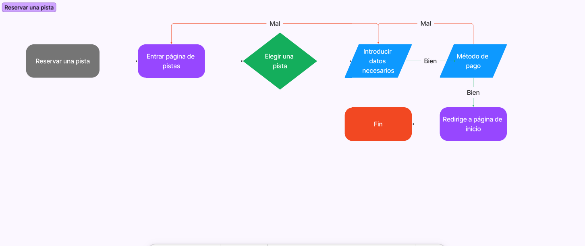

 2.c IA: Sitemap + Labelling 
----
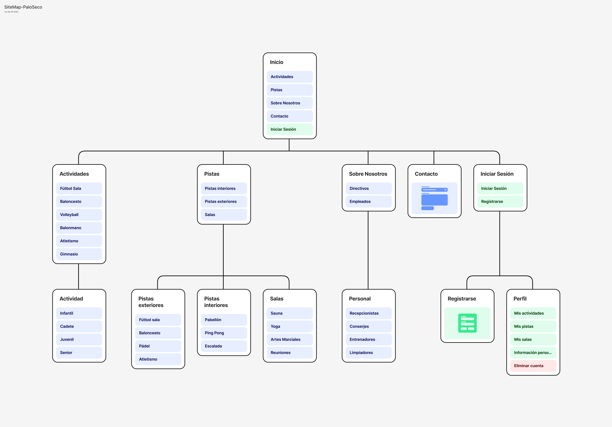

>>> Identificar términos para diálogo con usuario  

Término | Significado     
| ------------- | -------
  Login¿?  | acceder a plataforma

 2.d Wireframes
-----

>>> Plantear el  diseño del layout para Web/movil (organización y simulación ) 

## Paso 3. Mi UX-Case Study (diseño)

 3.a Moodboard
-----

>>> Plantear Diseño visual con una guía de estilos visual (moodboard) 
>>> Incluir Logotipo
>>> Si diseña un logotipo, explique la herramienta utilizada y la resolución empleada. ¿Puede usar esta imagen como cabecera de Twitter, por ejemplo, o necesita otra?
 
Para el diseño visual vamos a conseguir un logotipo que represente nuestra vision sobre
el deporte que combine con nuestro titulo y llame la atención.
Este logo se podrá usar en diferentes reses sociales como Twitter ya que tendremos diferentes
versiones del mismo.
Una paleta de colores que represente naturalez, frescura, motivación, energía, pureza, 
simplicidad, modernidad y estabilidad.
Imagenes que representen los deportes que ofrecemos.
Fuentes modernas, decorativa y distintivas para el logo y las cabezeras y otra mas limpia y legible.
Iconos representativos y globales para las principales funciones de la página.

  3.b Landing Page
----

>>> Plantear Landing Page 
 
La landing Page constará de un Título inspirador y motivador junto con un subtítulo llamativo y que genere en los clientes sentimientos de querer participar.
Un elemento gráfico que refuerze nuestra idea basado en la naturaleza y el deporte.
Un par de beneficios sobre nuestras instalaciones para llamar más la atención de los clientes.
Y un cta para acceder a la página.

 3.c Guidelines
----

>>> Estudio de Guidelines y Patrones IU a usar 
>>> Tras documentarse, muestre las deciones tomadas sobre Patrones IU a usar para la fase siguiente de prototipado. 

  3.d Mockup
----

>>> Layout: Mockup / prototipo HTML  (que permita simular tareas con estilo de IU seleccionado)

 3.e ¿My UX-Case Study?
-----

>>> Publicar my Case Study en Github..
>>> Documente y resuma el diseño de su producto
 
Finalmente nuestro producto se centra en el diseño de una página web consistente y con
todas las medidas de accesibilidad posibles cumpliendo unos objtivos claros de un buen diseño visual para atraer visitas, 
una landing page con una bienvenida amigable y llamativa hacia nuestro proyecto y un layout simulando nuestra web final.

## Paso 5. Exportación & evaluación con Eye Tracking 

Exportación a HTML/Flutter
-----

)  5.b Eye Tracking method 

>>> Indica cómo diseñas experimento y reclutas usuarios (uso de gazerecorder.com)  

Diseño del experimento 
----

>> Uso de imágenes (preferentemente) -> hay que esablecer una duración de visualización y  
>> fijar las áreas de interes (AoI) antes del diseño. Planificar qué tarea debe hacer el usuario (buscar, comprar...) 

  
>> cambiar img por tu diseño de experimento  

>> Recordar que gazerecorder es una versión de pruebas: usar sólo con 3 usuarios para generar mapa de calor (recordar que crédito > 0 para que funcione) 

Resultados y valoración 
-----

>> Cambiar por tus resultados
  

## Paso 4. Evaluación 

 4.a Caso asignado
----

>>> Breve descripción del caso asignado con enlace a  su repositorio Github

 4.b User Testing
----

>>> Seleccione 4 personas ficticias. Exprese las ideas de posibles situaciones conflictivas de esa persona en las propuestas evaluadas. Asigne dos a Caso A y 2 al caso B
 

| Usuarios | Sexo/Edad     | Ocupación   |  Exp.TIC    | Personalidad | Plataforma | TestA/B
| ------------- | -------- | ----------- | ----------- | -----------  | ---------- | ----
| User1's name  | H / 18   | Estudiante  | Media       | Introvertido | Web.       | A 
| User2's name  | H / 18   | Estudiante  | Media       | Timido       | Web        | A 
| User3's name  | M / 35   | Abogado     | Baja        | Emocional    | móvil      | B 
| User4's name  | H / 18   | Estudiante  | Media       | Racional     | Web        | B 

 4.c Cuestionario SUS
----

>>> Usaremos el **Cuestionario SUS** para valorar la satisfacción de cada usuario con el diseño (A/B) realizado. Para ello usamos la [hoja de cálculo](https://github.com/mgea/DIU19/blob/master/Cuestionario%20SUS%20DIU.xlsx) para calcular resultados sigiendo las pautas para usar la escala SUS e interpretar los resultados
http://usabilitygeek.com/how-to-use-the-system-usability-scale-sus-to-evaluate-the-usability-of-your-website/)
Para más información, consultar aquí sobre la [metodología SUS](https://cui.unige.ch/isi/icle-wiki/_media/ipm:test-suschapt.pdf)

>>> Adjuntar captura de imagen con los resultados + Valoración personal 

 4.d Usability Report
----

>> Añadir report de usabilidad para práctica B (la de los compañeros)

>>> Valoración personal 

5.) Conclusion de EVALUACION (A/B testing + usability report + eye tracking) 
----

>> recupera el usability report de tu práctica (que es el caso B de los asignados a otros grupos) 
>> con los resultados del A/B testing, de eye tracking y del usability report:
>>  comentad en 2-3 parrafos cual es la conclusion acerca de la realización de la práctica y su evaluación con esas técnicas y que habéis aprendido

## Conclusión final / Valoración de las prácticas

>>> (90-150 palabras) Opinión FINAL del proceso de desarrollo de diseño siguiendo metodología UX y valoración (positiva /negativa) de los resultados obtenidos  

