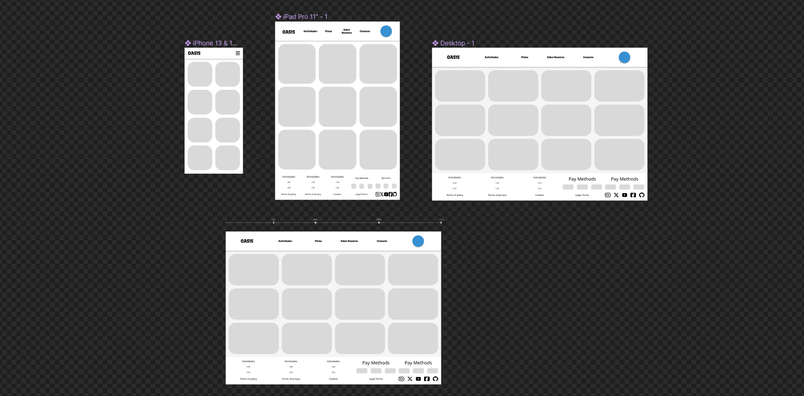
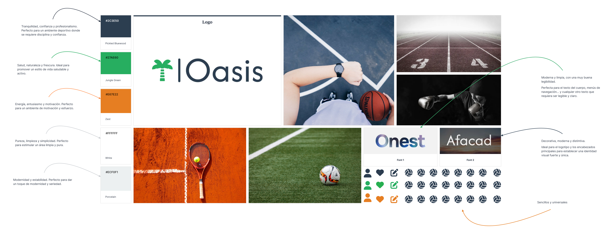
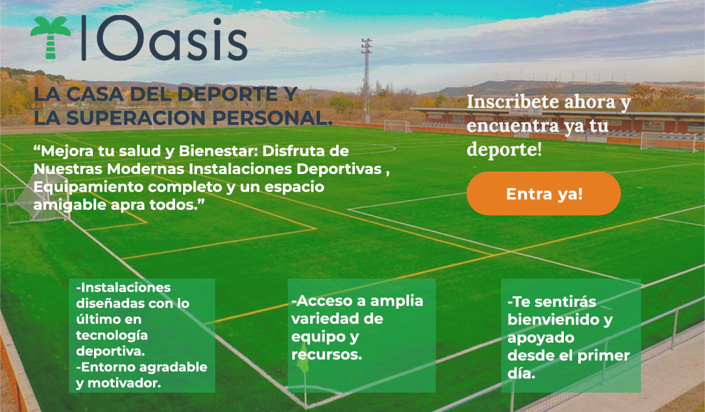

# DIU24
Prácticas Diseño Interfaces de Usuario 2023-24 (Tema: .... ) 

Grupo: DIU1_PaloSeco.  Curso: 2023/24 
Updated: 14/3/2024

<b>Proyecto</b> 
 
Oasis

<b>Descripción</b>
  
Polideportivo que oferta cursos y alquileres de pistas

<b>Logotipo</b>
  

Miembros
 * :bust_in_silhouette:  Adrián Castro Reyes     :octocat:     
 * :bust_in_silhouette:  Antonio García Torres     :octocat:

-----
# Proceso de Diseño 

## Paso 1. UX User & Desk Research & Analisis 

 **1.a User Reseach Plan**
-----

<b>User research - (plan) template </b>
Realizaremos varias encuestas a numerosas personas en un abanico de edad muy amplio. Los temas podrían ser ¿Cuánto estarían dispuestos a pagar por unas clases de teatro? ¿Cuánto pagarían por ver una obra de teatro?
 
La investigación nos proporcionará un abanico de edades y precios que algunas de estas personas estarían dispuestas a pagar por una actividad. Con este enfoque, podríamos precisar hacia qué público y edades deberían de estar destinados nuestro servicios para un mayor porcentaje de éxito. 

 1.b Competitive Analysis
-----

En este análisis de competencia llevamos acabo un estudio de tres empresas de la competencia como son The Actors Studio, The Second City, y Teatro Real.
 
En este análisis de competencia llevamos acabo un estudio de tres empresas de la competencia como son The Actors Studio, The Second City, y Teatro Real.
 
Con cada de una de las empresas vamos a ver una serie de características, en Bussiness Model nos centramos en el Precio, Marketing y Ofertas las cuales son las bases para un buen negocio.
En technological issues hay que tener en cuenta la plataforma la seguridad de la misma y la velocidad/rendimiento.
En functionality valoramos la Facilidad el Soporte de la página y la compatibilidad con diversos navegadores y dispositivos.
Con usability lo mas importante de valorar es la navegación por la pagina, la claridad de la misma y la accesibilidad para personas de todas las edades.
Y finalmente una serie de subjective issues como las fuerzas y las debilidades y una conclusión final

 1.c Persona
-----

Persona #1: Representa fielmente a las personas con problemas de accesibilidad debido a una o varias discapacidades

Persona #2: Esta persona representa a aquellas personas muy centradas en el trabajo que necesitan una vía de escape para volver a socializar y despejarse

 1.d User Journey Map
----
Persona #1: El escenario de esta persona representa fielmente un escenario habitual en el que una persona con discapacidad intenta contratar un servicio a través de una página web

Persona #2: Representa el escenario que recorre una persona trabajadora hasta que consigue asistir a un curso de la app y sus conclusiones finales

 1.e Usability Review
----

- documento:  Usability-review-template-2.pdf / Usability-review-template.xlsx
- Valoración final (numérica): 6,5
- Comentario sobre la valoración: Es una página web correcta, cumple con sus funcionalidades principales de información aunque tiene pequeños errores y algunos conceptos no son del todo intuitivos.

## Paso 2. UX Design  

 2.a Reframing / IDEACION: Feedback Capture Grid / EMpathy map 
----

>>> Comenta con un diagrama los aspectos más destacados a modo de conclusion de la práctica anterior,

 Interesante | Críticas     
| ------------- | -------
  Preguntas | Nuevas ideas
  
     
 
Oasis es un polideportivo que consiste en la creación de unas instalaciones para poder
ofrecer a nuestros clientes diferentes talleres de diferentes deportes, para que todas
las edades puedan disfrutar del deporte.
Nuestra misión es conseguir expandir la importancia del deporte fomentando el
crecimiento tanto personal como profesional de los clientes ofreciendo una amplia
gama de cursos, deportes y oportunidades de competición.

 2.b ScopeCanvas
----

 2.b User Flow (task) analysis 
-----

<b>Task Analysis</b>

<b>User Flows</b>

 2.c IA: Sitemap + Labelling 
----

 2.d Wireframes

----- 

## Paso 3. Mi UX-Case Study (diseño)

<h1> 🚀Demo Oasis🚀</h1>

https://www.figma.com/design/mCsUDRopyAOq8D0LQfepgl/PaloSeco---Oasis?node-id=41-9&t=yKfFrbMuQoepkTMS-0

 3.a Moodboard
-----
 
Para el diseño visual vamos a conseguir un logotipo que represente nuestra vision sobre
el deporte que combine con nuestro titulo y llame la atención.
Este logo se podrá usar en diferentes reses sociales como Twitter ya que tendremos diferentes
versiones del mismo.
Una paleta de colores que represente naturalez, frescura, motivación, energía, pureza, 
simplicidad, modernidad y estabilidad.
Imagenes que representen los deportes que ofrecemos.
Fuentes modernas, decorativa y distintivas para el logo y las cabezeras y otra mas limpia y legible.
Iconos representativos y globales para las principales funciones de la página.

3.b Landing Page
----
 
La landing Page constará de un Título inspirador y motivador junto con un subtítulo llamativo y que genere en los clientes sentimientos de querer participar.
Un elemento gráfico que refuerze nuestra idea basado en la naturaleza y el deporte.
Un par de beneficios sobre nuestras instalaciones para llamar más la atención de los clientes.
Y un cta para acceder a la página.

 3.c Guidelines
----

  3.d Mockup
----

<b>Video demo</b>
https://drive.google.com/file/d/1FB4z4e0SoxvE19RWYu9My5xuZeA7VSPa/view?usp=sharing

 3.e ¿My UX-Case Study?
-----
 
Finalmente nuestro producto se centra en el diseño de una página web consistente y con
todas las medidas de accesibilidad posibles cumpliendo unos objtivos claros de un buen diseño visual para atraer visitas, 
una landing page con una bienvenida amigable y llamativa hacia nuestro proyecto y un layout simulando nuestra web final.

## Paso 5. Exportación & evaluación con Eye Tracking 

Exportación a HTML/Flutter
-----

)  5.b Eye Tracking method 

>>> Indica cómo diseñas experimento y reclutas usuarios (uso de gazerecorder.com)  

Diseño del experimento 
----

>> Uso de imágenes (preferentemente) -> hay que esablecer una duración de visualización y  
>> fijar las áreas de interes (AoI) antes del diseño. Planificar qué tarea debe hacer el usuario (buscar, comprar...) 

  
>> cambiar img por tu diseño de experimento  

>> Recordar que gazerecorder es una versión de pruebas: usar sólo con 3 usuarios para generar mapa de calor (recordar que crédito > 0 para que funcione) 

Resultados y valoración 
-----

>> Cambiar por tus resultados
  

## Paso 4. Evaluación 

 4.a Caso asignado
----
Página web sobre reserva de cursos de cocina
https://github.com/carloshoyo/DIU?tab=readme-ov-file

 4.b User Testing
----
 

| Usuarios | Sexo/Edad     | Ocupación   |  Exp.TIC    | Personalidad | Plataforma | TestA/B
| ------------- | -------- | ----------- | ----------- | -----------  | ---------- | ----
| Carlos  | H / 53   | Auxiliar de enfermería  | Ninguna       | Extrovertido | Phone.       | A 
| Ruben  | H / 33   | Diseñador Gráfico  | Media       | Introvertida       | Phone        | A 
| Alberto  | H / 19   | Estudiante     | Muy Baja        | Introvertida    |Phone      | B 
| Clara  | M / 46   | Gerente de tienda  | Baja       | Sociable     | Phone        | B 

 4.c Cuestionario SUS
----

Ha habido una buena valoración en ambos test A y B, aunque el test A ha sido el que ha tenido una mejor valoración. En ambis test ha valorado la facilidad de uso y la claridad de la página, así como, la accesibilidad para personas de todas las edades. En ambos test se ha valorado la navegación por la página.

 4.d Usability Report
----

🚀
[Usability report para DIU2.CHL](<P4/4.-Usability Report/DIU_report-template-usability-DIU2-CHL-by-DIU1-PaloSeco.pdf>)
🚀

En nuestra opinión es una página muy completa, y aunque no destaque por su diseño, cumple con todas las funcionalidades necesarias para que el usuario pueda navegar por ella sin problemas. La página es clara y concisa, y aunque hay algunos errores, estos no son muy graves y no afectan a la experiencia del usuario. En general, la página es muy usable y fácil de navegar, y cumple con las expectativas de los usuarios. 

5.) Conclusion de EVALUACION (A/B testing + usability report + eye tracking) 
----

<video controls src="Oasis-eye-tracking 1.mp4" title="Oasis Eye tracking"></video>

Nuestra valoración final es que la página es muy usable y fácil de navegar, y cumple con las expectativas de los usuarios. Aunque hay algunos errores, estos no son muy graves y no afectan a la experiencia del usuario. En general, la página es clara y concisa, y cumple con todas las funcionalidades necesarias para que el usuario pueda navegar por ella sin problemas. La página es muy completa, y aunque no destaque por su diseño, es muy usable y fácil de navegar.

## Conclusión final / Valoración de las prácticas

En nuestra opinión, el proyecto ha sido muy interesante y nos ha permitido aprender mucho sobre el diseño de interfaces de usuario. Hemos podido aplicar los conocimientos adquiridos en clase y hemos podido ver cómo se aplican en la práctica. Además, hemos podido trabajar en equipo y hemos podido ver cómo se trabaja en un proyecto de diseño de interfaces de usuario. En general, ha sido una experiencia muy positiva y nos ha permitido aprender mucho sobre el diseño de interfaces de usuario.

Como punto de mejora, creemos que podríamos haber profundizado más en algunos aspectos del proyecto, como el diseño visual o la usabilidad de la página. También creemos que podríamos haber trabajado más en equipo y haber colaborado más entre nosotros. En general, creemos que el proyecto ha sido muy positivo y nos ha permitido aprender mucho sobre el diseño de interfaces de usuario.

